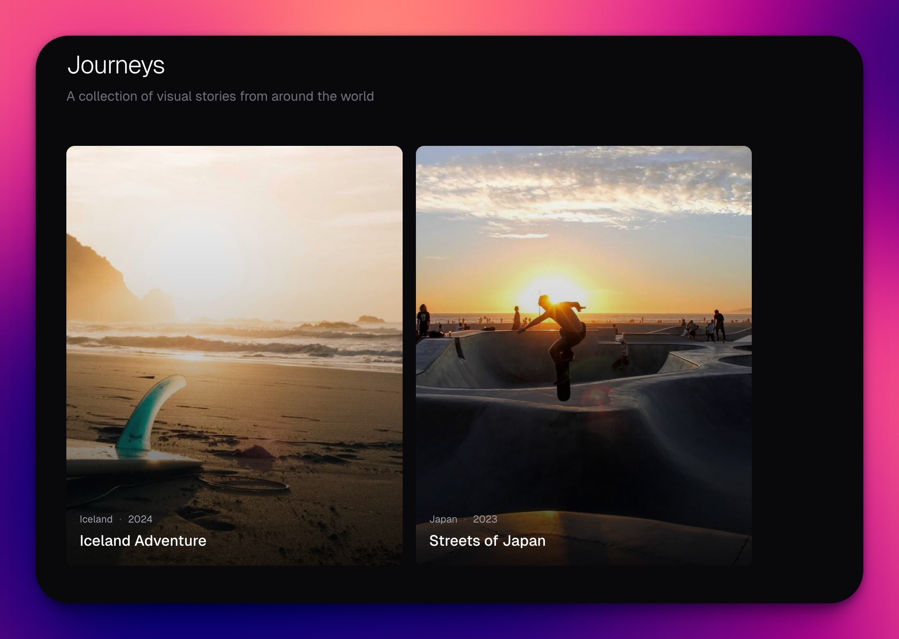

## Quick Start

```bash
npm install
npm run dev
```

Open http://localhost:3000

## Site Config

Edit `content/site.json` to customize title and description:

```json
{
  "title": "Journeys",
  "description": "TODO"
}
```

## Adding a Journey

1. Create a new folder in `content/journeys/`:
   ```bash
   mkdir content/journeys/my-trip
   ```

2. Create `journey.json`:
   ```json
   {
     "title": "My Trip",
     "description": "A brief description.",
     "date": "2024-01-15",
     "location": "Location Name",
     "coverImage": "sunset.jpg" // optional
   }
   ```

3. Add your images to the folder.

4. Restart to see your new journey!
